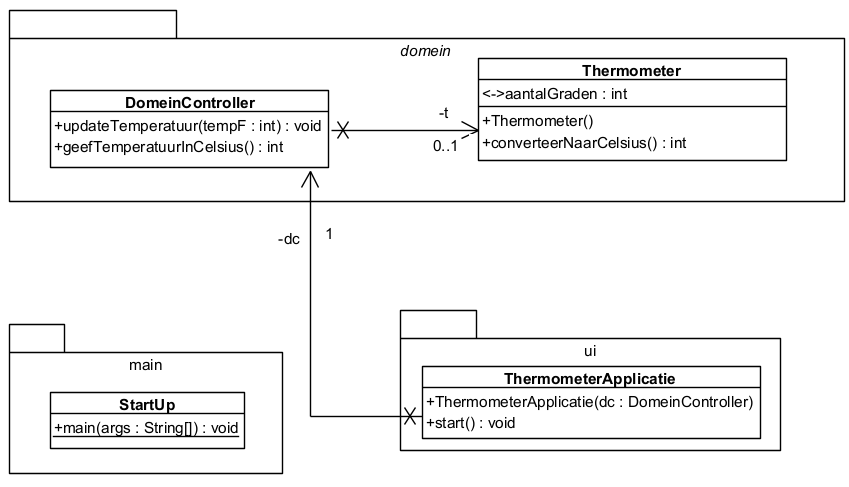

# Opgave

## Exception werpen en opvangen in de UI-laag



Vervolledig de consoleapplicatie in de klasse `ThermometerApplicatie` die een temperatuur in **Fahrenheit** opvraagt,
omzet in een
temperatuur in **Celsius** en het resultaat toont.

Gebruik de gegeven domeinklasse `Thermometer` om de temperatuur om te zetten! De volgende formule is er reeds
geïmplementeerd:

$$°C = \frac{5}{9} \times (°F - 32)$$

De parameterloze constructor maakt een thermometer aan waarbij de starttemperatuur ingesteld is op **32 °F**.

Zorg ervoor dat een foutieve input (= niet numeriek of buiten de grenzen van het interval **[14 °F, 104 °F]**) wordt
gemeld.
Handel alle fouten meteen (in `ThermometerApplicatie`) af!

Respecteer de bovenstaande UML en gebruik dus ook de `DomeinController`-klasse als doorgeefluik tussen de UI en het
domein. De applicatie kan gestart worden via de klasse `StartUp` uit de package `main`.

### Verwachte uitvoer:

```text
Geef een gehele temperatuur in °F uit het interval [14,104]: blabla
De invoer moet een geheel getal zijn!
Geef een gehele temperatuur in °F uit het interval [14,104]: 500
Waarde van temperatuur moet uit het interval [14,104] komen!
Geef een gehele temperatuur in °F uit het interval [14,104]: 10
Waarde van temperatuur moet uit het interval [14,104] komen!
Geef een gehele temperatuur in °F uit het interval [14,104]: 20
De temperatuur in °C is -6