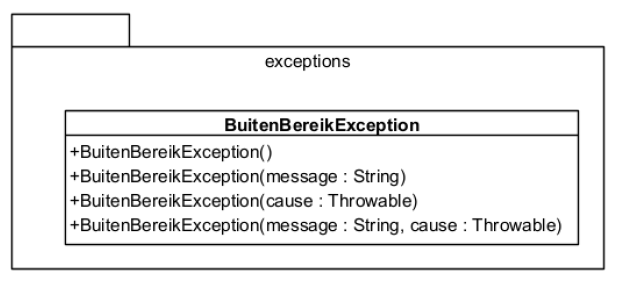

# Opgave 04 - Thermometer deel 4

## Een eigen Exception klasse schrijven



* schrijf je eigen exception klasse `BuitenBereikException` volgens de gegeven UML.
  De klasse erft van `IllegalArgumentException`.
* werp een instantie van deze exception indien iets misloopt in de setter `setAantalGraden` in de klasse `Thermometer`.
* zorg dat alle unit testen slagen
* pas de `ThermometerApplicatie` aan om expliciet dit soort exceptions op te vangen.

### Voorbeeld uitvoer (ongewijzigd):

```text
Geef een gehele temperatuur in °F uit het interval [14,104]: blabla
De invoer moet een geheel getal zijn!
Geef een gehele temperatuur in °F uit het interval [14,104]: 500
Waarde van temperatuur moet uit het interval [14,104] komen!
Geef een gehele temperatuur in °F uit het interval [14,104]: 10
Waarde van temperatuur moet uit het interval [14,104] komen!
Geef een gehele temperatuur in °F uit het interval [14,104]: 20
De temperatuur in °C is -6
```