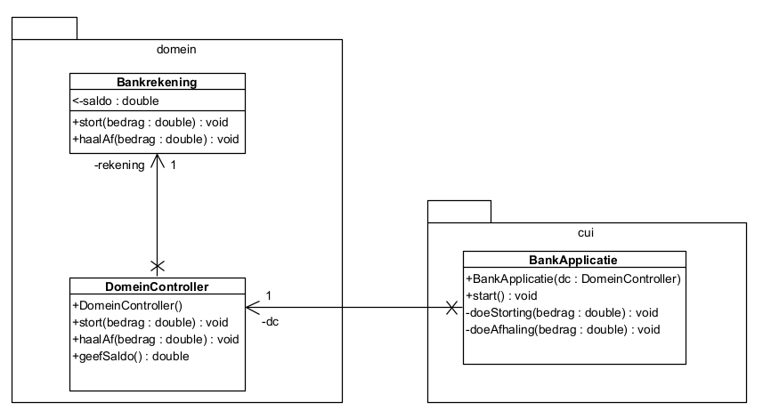
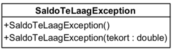

# Opgave 05 Bankapplicatie

<!---
## Doelstelling

Het aanleren van het onderscheid tussen **Checked Exceptions** (voorzienbare domeinfouten) en **Unchecked Exceptions
** (
programmeer- of invoerfouten) binnen een gelaagde architectuur.
-->

Vertrek van het start project **h04-oef05-bankapp-starter**. De bedoeling van deze simpele app is dat
een gebruiker geld kan storten en afhalen van een bankrekening.



## De opdracht

Maak de applicatie robuust en implementeer de domeinregels. Volg onderstaande richtlijnen.



1. Schrijf, in een package `exceptions` een eigen **checked** exceptieklasse `SaldoTeLaagException`, afgeleid van
   `Exception`.
   Roep vanuit dat de constructor met een double parameter de constructor aan van de superklasse en geef een gepast
   bericht door:

   Bijvoorbeeld: _"Transactie geweigerd: je komt 12.50 EUR tekort."_


2. Pas de domeinklasse `Bankrekening` aan zodat:

    * er gecontroleerd wordt op positieve bedragen bij _storten_ en _afhalen_ (indien fout: `IllegalArgumentException`).
    * er gecontroleerd wordt of het saldo toereikend is bij _afhalen_ (indien fout: de checked exception
      `SaldoTeLaagException`).
        * Het werpen van een checked exception kan ertoe leiden dat je nu ook in andere klassen aanpassingen moet doen.
    * zorg dat alle **unit testen** slagen


3. Pas de `BankApplicatie` aan. De applicatie verwerkt transacties via het toetsenbord volgens het formaat
   `[actie] [bedrag]`.

De invoerlijn bevat een _letter_ en een _getal_ gescheiden door een spatie.
De letter stelt de transactie voor: `s` voor storten, `a` voor afhalen. Het decimale getal
is het bedrag die men wenst te storten of af te halen, bv. `s 100.0` betekent dat men 100.0 Euro wil storten.

* Splits de invoerlijn met de methode `split(" ")`. Bekijk de `String` methode `split` in de Java-api om exact te
  zien wat deze methode doet en retourneert.
* Indien het resultaat van de split geen twee elementen in de array zitten: gooi een `IllegalArgumentException`. Anders:
    * zet het eerste deel in een String variabele `actie`
    * zet het tweede deel om naar een `double` en stop het resultaat in een double variable `bedrag`.


* Maak de applicatie nu volledig robuust. Zet de code in de `else`-tak nu in een `try`-blok, vang de verschillende
  exceptions op en
  geef een duidelijk bericht aan de gebruiker indien iets misloopt in de applicatie.

### Voorbeeld uitvoer:

```
--- HOGENT Bank ---

Huidig saldo: 0,00 EUR
Geef transactie (s of a) en bedrag gescheiden door een spatie (bv. 's 50.0' of 'a 12.5') of 'stop': t 120.50
Ongeldige transactie. Gebruik 's' voor storten, of 'a' voor afhalen.

Huidig saldo: 0,00 EUR
Geef transactie (s of a) en bedrag gescheiden door een spatie (bv. 's 50.0' of 'a 12.5') of 'stop': s 120.50
Transactie succesvol: bedrag gestort.

Huidig saldo: 120,50 EUR
Geef transactie (s of a) en bedrag gescheiden door een spatie (bv. 's 50.0' of 'a 12.5') of 'stop': a 5000
Bankfout: Transactie geweigerd: je komt 4879,50 EUR tekort.

Huidig saldo: 120,50 EUR
Geef transactie (s of a) en bedrag gescheiden door een spatie (bv. 's 50.0' of 'a 12.5') of 'stop': a 100
Transactie succesvol: bedrag afgehaald.

Huidig saldo: 20,50 EUR
Geef transactie (s of a) en bedrag gescheiden door een spatie (bv. 's 50.0' of 'a 12.5') of 'stop': a honderd
Fout: Het bedrag moet een geldig getal zijn.

Huidig saldo: 20,50 EUR
Geef transactie (s of a) en bedrag gescheiden door een spatie (bv. 's 50.0' of 'a 12.5') of 'stop': stoppen
Invoerfout: Gebruik: [s|a] [bedrag]

Huidig saldo: 20,50 EUR
Geef transactie (s of a) en bedrag gescheiden door een spatie (bv. 's 50.0' of 'a 12.5') of 'stop': stop

Bankapplicatie wordt afgesloten, tot een volgende keer...
```