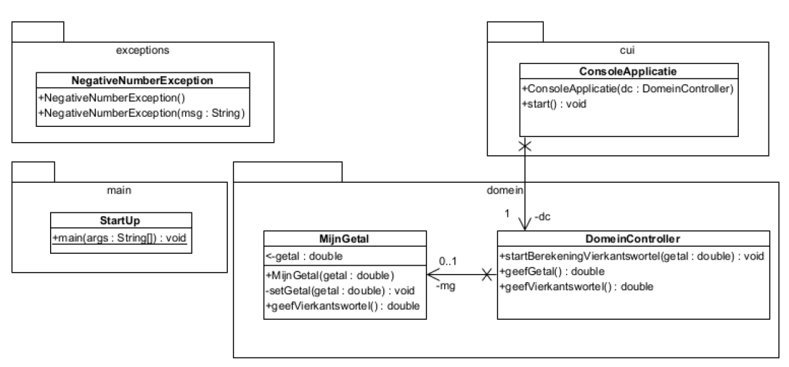

# Opgave 05 - Mijn getal

Schrijf een eigen exceptieklasse `NegativeNumberException`, afgeleid van `Exception`.

Gebruik deze klasse in een applicatie, die invoer krijgt via het toetsenbord.

De invoerlijn bevat **normaal** twee positieve decimale getallen. Splits de invoerlijn dus eerst op (zie tip). Krijg je
geen
twee elementen in de array, gooi dan een `NoSuchElementException`.

Probeer vervolgens de twee Strings om te zetten naar decimale getallen.

Als je zeker weet dat het om decimale getallen gaat, geef je ze door aan de `DomeinController` die er een `MijnGetal`
-object
van maakt. Hierbij controleer je of ze wel degelijk positief zijn (controle in klasse `MijnGetal`). Gooi een fout indien
foutieve waarde.

Bepaal van deze beide getallen de vierkantswortel en schrijf die naar de console.

[text]
----
Geef 2 positieve decimale getallen gescheiden door een spatie: 12
Er moeten 2 delen in de invoer zijn gescheiden door een spatie
Geef 2 positieve decimale getallen gescheiden door een spatie: a
Er moeten 2 delen in de invoer zijn gescheiden door een spatie
Geef 2 positieve decimale getallen gescheiden door een spatie: 15.5 16.6
De vierkantswortel van 15,50 is 3,94
De vierkantswortel van 16,60 is 4,07
----

[TIP]
====
Klasse String, methode split(...)

image::.\split.png[align="center"]
====