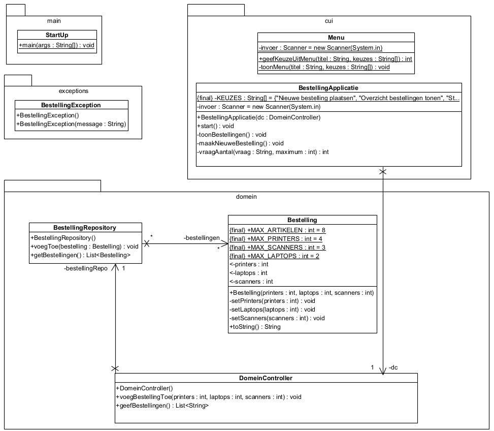

# Opgave 08 Bestelling

<!---
## Doelstelling

Het aanleren van het onderscheid tussen **Checked Exceptions** (voorzienbare domeinfouten) en **Unchecked Exceptions
** (
programmeer- of invoerfouten) binnen een gelaagde architectuur.
-->

## Robuust Bestelsysteem (Printers, Scanners & Laptops)

Ontwikkel een robuuste console-applicatie voor het beheren van bestellingen. De focus van deze oefening ligt op *
*validatie in meerdere lagen** en het correct afhandelen van **custom exceptions**.

### 1. Domeinregels (Validatie)

Een bestelling is alleen geldig als deze voldoet aan de volgende strikte kwantitatieve restricties:

| Artikeltype  | Maximum aantal |
|:-------------|:---------------|
| **Printers** | Hoogstens 4    |
| **Scanners** | Hoogstens 3    |
| **Laptops**  | Hoogstens 2    |

**Totaaloverzicht:** Een volledige bestelling moet minimaal **1** en maximaal **8** artikelen in totaal bevatten.

## 2. Foutafhandeling & Exception Strategie

Implementeer een hiërarchie in foutmeldingen om de robuustheid te garanderen:

* **BestellingException:** Maak deze klasse aan als subklasse van `Exception`. Werp deze enkel wanneer het **totaal
  aantal artikelen** (som van alle types) minder dan 1 of meer dan 8 bedraagt.
* **IllegalArgumentException:** Gebruik deze standaard Java-exception wanneer een individueel aantal (bijv. 5 printers)
  de specifieke limiet overschrijdt.
* **Menu-validatie:** Zorg dat de UI onmiddellijk reageert op ongeldige invoer (tekst in plaats
  van cijfers, negatieve getallen of getallen buiten het bereik).

## 3. Architectuur: UI vs. Domein

De validatie vindt plaats op twee niveaus:

1. **De UI-laag**

   1.1. **`Menu`**: Controleert de gemaakte menukeuze. Geeft directe feedback aan de gebruiker indien er sprake is van
   ongeldige invoer (zoals tekst in plaats van cijfers of keuzes buiten het bereik).

   1.2. **`BestellingApplicatie`**: Controleert direct de individuele aantallen per type. Dit zorgt voor snelle feedback
   naar de gebruiker zonder onnodige communicatie met de domeinlaag.

2. **De Domein-laag (`Bestelling`)**

   2.1. **Validatie**: Voert een finale controle uit op zowel de individuele maxima per artikel als het algemene totaal.
   Dit garandeert de integriteit van de data, ongeacht welke UI (bijv. een webinterface) later wordt gekoppeld.

   2.2. **Opmerking**: De specifieke controle op het **totaal** (minimaal 1 en maximaal 8 artikelen) vindt uitsluitend
   plaats binnen het domein.

   2.3 **Unit testen**: Zodra je de `BestellingException` hebt toegevoegd en je het domein robuust hebt gemaakt slagen
   alle unit testen!

## 4. Klassenontwerp

Baseer de implementatie op het onderstaande UML-diagram:

